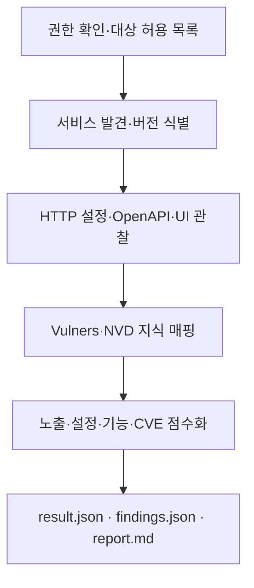

# Python ASM Framework

> 허가된 자산의 외부 노출면을 발견하고, 서비스·기능·CVE 맥락을 하나의 리스크 흐름으로 정리하는 Attack Surface Management 프로토타입

[](https://www.python.org/)
[](https://nmap.org/)
[](#안전-및-권한-경계)

이 프로젝트는 단순히 열린 포트를 나열하는 데서 멈추지 않습니다. Nmap 서비스 탐지, HTTP 설정 관찰, Swagger/OpenAPI 구조, 선택적 CVE 조회를 결합해 **어떤 자산이 왜 공격 표면이 되는지** 설명 가능한 결과로 변환합니다.

## 프로젝트 포지션

| 프로젝트 | 관찰 대상 | 포트폴리오 역할 |
|---|---|---|
| [DotasPlus](https://github.com/rasasoe/DotasPlus) | 외부 위협 정보·IOC | CTI 수집/정규화 실험 |
| **Python ASM Framework** | 운영 자산의 서비스·노출·CVE 맥락 | 외부 공격 표면 분석 |
| [VSH](https://github.com/rasasoe/VSH) | 소스 코드·의존성·SBOM | AppSec 대표 프로젝트 |

세 프로젝트를 한 저장소로 섞는 대신 도메인별 책임은 분리하고, ASM은 `findings.json`이라는 버전이 명시된 결과 형식을 제공해 향후 통합 대시보드가 소비할 수 있도록 설계했습니다.

## 분석 워크플로우



| 단계 | 입력/수집 | 결과 |
|---|---|---|
| 1. 범위 확인 | `authorization.allowed_targets` | 승인되지 않은 대상 실행 차단 |
| 2. 기술 표면 | Nmap `-Pn -p- -sV --version-light` | 열린 포트, 서비스, 제품/버전 |
| 3. 기능 표면 | HTTP 헤더, Swagger/OpenAPI, 선택적 Selenium | 설정 누락, API 엔드포인트, 화면 기능 |
| 4. 지식 보강 | 선택적 Vulners/NVD API | 서비스 지문과 CVE 참고 정보 연결 |
| 5. 리스크 산정 | 노출·구성·기능·CVE 맥락 | 자산 및 서비스별 0–100 점수 |
| 6. 결과 생성 | 정규화/보고 모듈 | 기계 판독 JSON과 Markdown 보고서 |

## 주요 기능

- 전체 TCP 포트와 서비스/버전 식별
- 최선 노력 방식의 OS 추정
- HTTP 보안 헤더와 공개 설정 관찰
- Swagger/OpenAPI 문서 기반 API 구조 파악
- 클릭·입력 없는 Selenium UI 요소 관찰
- 선택적 Vulners CVE 매핑 및 NVD 상세 정보 보강
- 노출, 설정, 기능, CVE 지식을 결합한 리스크 점수
- 상세 결과, 공통 finding 계약, 읽기 쉬운 보고서 동시 생성

## 범위와 한계

이 도구는 **발견과 맥락화**를 위한 프로토타입입니다.

- 수행: 서비스 탐지, 공개 HTTP/OpenAPI 조회, 화면 요소 관찰, 공개 취약점 DB 조회
- 미수행: 익스플로잇, 인증 우회, 악성 페이로드, 데이터 변조, 취약점 PoC 검증
- 해석 주의: 서비스 지문과 CVE의 연결은 지식 기반 후보이며 실제 취약성을 증명하지 않습니다.
- 활동성 주의: Nmap `-sV`와 HTTP 요청은 대상에 패킷과 요청을 보내는 **능동적 프로빙**입니다.

## 프로젝트 구조

```text
python-asm-framework/
├── asm.py                       # 실행 오케스트레이션과 권한 확인
├── config.yaml                  # 대상·수집·API 설정
├── core/                        # 자산 데이터 모델
├── scanner/                     # Nmap·HTTP·Selenium 수집기
├── parser/                      # OpenAPI/UI 결과 파싱
├── vuln/                        # Vulners·NVD 연동
├── risk/                        # 리스크 계산
├── report/
│   ├── markdown_report.py       # 사람이 읽는 보고서
│   └── normalized_findings.py   # 통합용 finding 계약
└── tests/                       # 네트워크 없는 결정론적 단위 테스트
```

## 빠른 시작

### 1. 요구 사항

- Python 3.10 이상
- Nmap 설치 및 PATH 등록
- 선택: UI 관찰 기능을 위한 Chrome
- 선택: CVE 보강을 위한 Vulners/NVD API 키

```bash
pip install -r requirements.txt
nmap --version
```

### 2. 대상과 권한 설정

기본 설정은 로컬 실습 대상만 허용합니다.

```yaml
target:
  ip: 127.0.0.1
  base_url: http://127.0.0.1:3000
  swagger_path: /api-docs/swagger.yaml

authorization:
  acknowledged: false
  allowed_targets:
    - 127.0.0.1
```

소유권이나 명시적 허가를 확인한 뒤 `acknowledged: true`로 변경하세요. `target.ip`와 `target.base_url`의 호스트 중 하나라도 `authorization.allowed_targets`에 없거나 `acknowledged`가 `false`이면 실행을 중단합니다.

### 3. 선택 기능 설정

```yaml
collection:
  run_nse_safe: false
  run_selenium: false

vulners:
  enabled: false
  api_key: "PUT_YOUR_VULNERS_API_KEY_HERE"

nvd:
  enabled: false
  api_key: ""
```

API 키는 공개 저장소에 커밋하지 마세요. 환경별 비공개 설정이나 시크릿 관리 수단을 사용하세요.

### 4. 실행

```bash
python asm.py
```

## 결과물

| 파일 | 용도 |
|---|---|
| `output/result.json` | 자산·기술 표면·기능 표면·CVE·리스크의 전체 결과 |
| `output/findings.json` | 다른 보안 프로젝트나 대시보드가 소비할 정규화된 결과 |
| `output/report.md` | 사람이 검토할 Markdown 요약 보고서 |

`findings.json`은 `schema_version: "1.0"`을 포함하고, 노출 서비스마다 다음 필드를 제공합니다.

```json
{
  "source": "python-asm-framework",
  "asset": {"type": "host", "value": "127.0.0.1", "environment": "local"},
  "finding_type": "attack_surface.service_exposure",
  "severity": "medium",
  "score": 25,
  "confidence": 0.75,
  "confidence_basis": "product and version fingerprint",
  "evidence": {},
  "references": [],
  "detected_at": "2026-01-01T00:00:00+00:00"
}
```

## 테스트

현재 테스트는 외부 네트워크나 실제 스캔 없이 리스크 계산과 정규화 결과 계약을 검증합니다.

```bash
PYTHONDONTWRITEBYTECODE=1 python -m unittest discover -s tests -v
```

실제 수집 검증은 본인 소유의 로컬 서버, 개인 실습 VM, 또는 로컬 Docker로 실행한 [OWASP Juice Shop](https://owasp.org/www-project-juice-shop/) 같은 의도적 실습 환경을 권장합니다.

```bash
docker run -d -p 3000:3000 bkimminich/juice-shop
```

## 수집 방식과 활동성

| 정보 | 수집 방식 | 활동성 | 설명 |
|---|---|---:|---|
| 포트·서비스·버전 | Nmap `-sV` | 능동적 | 서비스 식별 프로브 전송 |
| 보안 헤더 | HTTP 요청 | 능동적 | 설정한 URL의 응답 헤더 관찰 |
| API 구조 | Swagger/OpenAPI 조회 | 능동적 | 공개 문서 경로 요청 및 파싱 |
| UI 요소 | Selenium | 능동적 관찰 | 페이지 로드 후 표시 요소 수집, 클릭·입력 없음 |
| CVE 후보 | Vulners/NVD | 외부 DB 조회 | 대상이 아닌 공개 지식베이스에 질의 |

## 안전 및 권한 경계

이 프로젝트는 교육 및 연구용입니다. 본인이 소유하거나 명시적인 분석 허가를 받은 시스템에만 사용해야 합니다. 허가 여부가 불명확하면 실행하지 마세요.

코드 수준에서는 대상 허용 목록과 확인 플래그를 검사하지만, 이것이 법적 허가를 대신하지는 않습니다. 사용자는 스캔 범위, 시간, 요청량, 데이터 취급 조건을 포함한 실제 승인 범위를 지켜야 합니다.

## 현재 상태와 다음 단계

- 현재: 발견 → 맥락화 → 점수화 → 3종 결과 생성까지 동작하는 집중형 프로토타입
- 완료: 권한 확인 가드, 결정론적 단위 테스트, 버전이 명시된 finding 결과 형식
- 다음: 수집기별 fixture/mock 테스트, CLI 옵션, 스키마 검증, 실제 통합 대시보드 소비자

이 저장소의 목표는 공격 기능의 수가 아니라 **범위 통제, 근거 보존, 결과 정규화까지 포함한 보안 엔지니어링 흐름**을 보여주는 것입니다.
